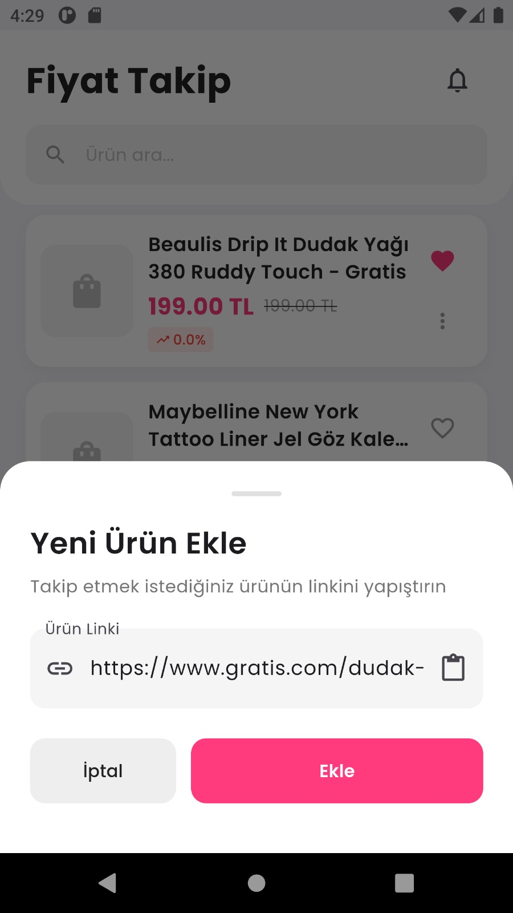
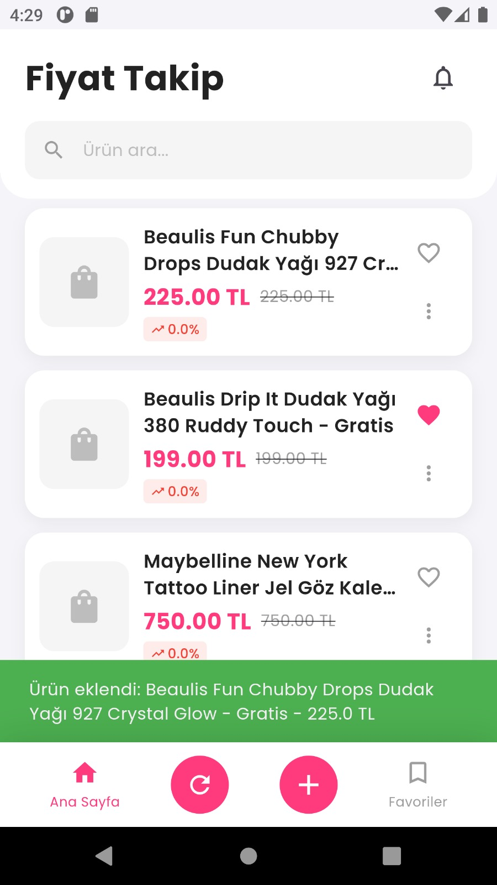
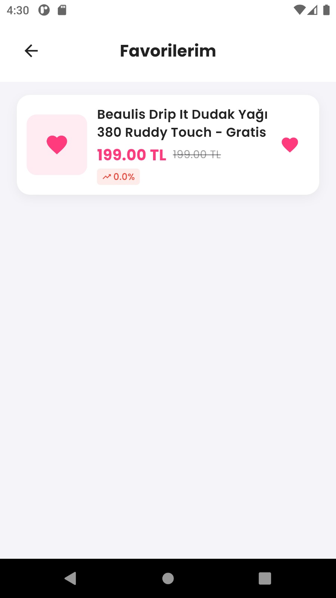
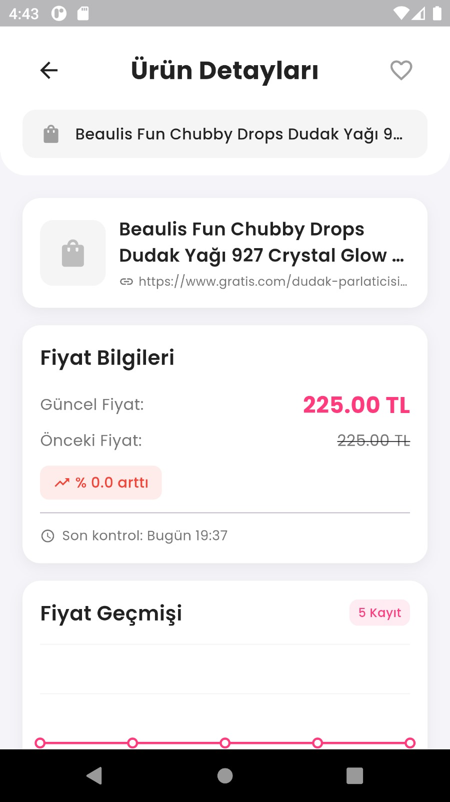
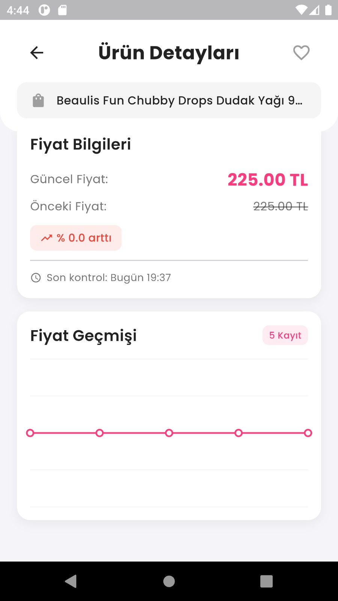

# Fiyat Takip Uygulaması

- Ürün fiyatlarını takip eden Flask + Flutter uygulaması

## Özellikler

- Ürün linkini yapıştırarak takip listesine ekleme
- Otomatik fiyat kontrolü (30 dakikada bir)
- Fiyat düşüşü bildirimleri
- Fiyat geçmişi grafiği
- Manuel fiyat kontrolü
## 📸 Uygulamadan Ekran Görüntüleri

<table>
  <tr>
    <td align="center">
      
      <br/>
      <sub><b>Ürün URL Ekleme</b> — Takip etmek istediğiniz ürünün linkini yapıştırın.</sub>
    </td>
    <td align="center">
      
      <br/>
      <sub><b>Ürün Ekleme Sonrası</b> — Link doğrulanır, ürün özet bilgileri görünür.</sub>
    </td>
  </tr>
  <tr>
    <td align="center">
      
      <br/>
      <sub><b>Favoriler</b> — Sık takip edilen ürünleri tek ekranda toplayın.</sub>
    </td>
    <td align="center">
      
      <br/>
      <sub><b>Ürün Detayı (1)</b> — Güncel fiyat, son kontrol ve durum bilgileri.</sub>
    </td>
  </tr>
  <tr>
    <td align="center">
      
      <br/>
      <sub><b>Ürün Detayı (2)</b> — Fiyat geçmişi grafiği ve manuel kontrol.</sub>
    </td>
  </tr>
</table>

---

## Kurulum

### Backend (Python Flask)

1. Python bağımlılıkları:
```bash
cd backend
pip install -r requirements.txt
```

2. Flask API'yi başlatma:
```bash
python app.py
```

API http://localhost:5000 adresinde çalışacak.

### Mobil Tarafı (Flutter)

1. Flutter bağımlılıkları:
```bash
cd price_tracker_app
flutter pub get
```

2. Uygulamayı çalıştırın:
```bash
flutter run
```

## Kullanım

1. Backend'i başlatın (python app.py)
2. Flutter uygulamasını açın
3. "+" butonuna tıklayıp ürün linki ekleyin
4. Fiyatlar otomatik takip edilecek

## API Endpoints

- `GET /api/urunler` - Tüm ürünleri listele
- `POST /api/urun/ekle` - Yeni ürün ekle
- `GET /api/urun/<id>` - Ürün detayları
- `DELETE /api/urun/<id>` - Ürünü sil
- `POST /api/kontrol/baslat` - Manuel fiyat kontrolü

## Notlar

- Emülatörde test ederken API URL'i: http://10.0.2.2:5000
- Gerçek cihazda bilgisayarın IP adresi
